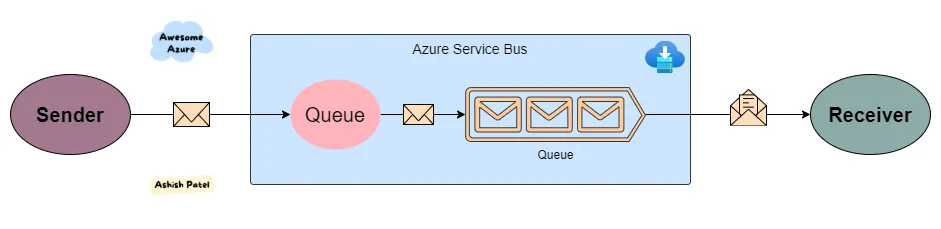
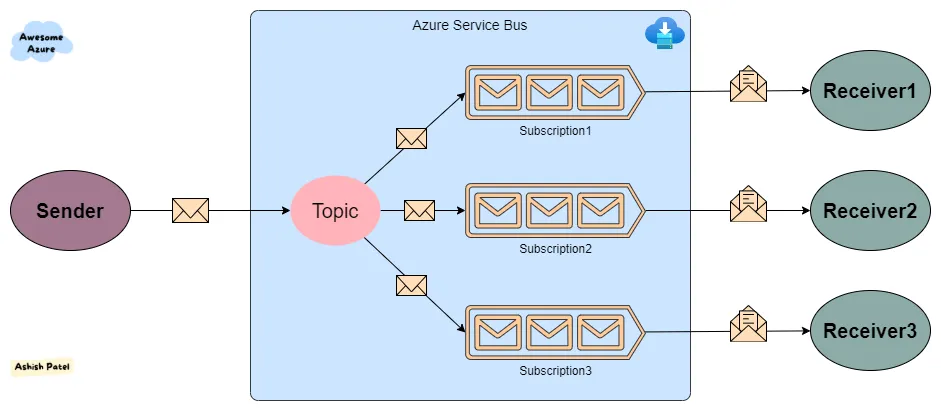

npm install -g pm2

pm2 install typescript

pm2 start 

pm2 monit

pm2 stop

## Service Bus

TL;DR:
Queues and Topics are similar when a sender sends messages, but messages are processed differently by a receiver. A queue can have only one consumer, whereas a topic can have multiple subscribers.

