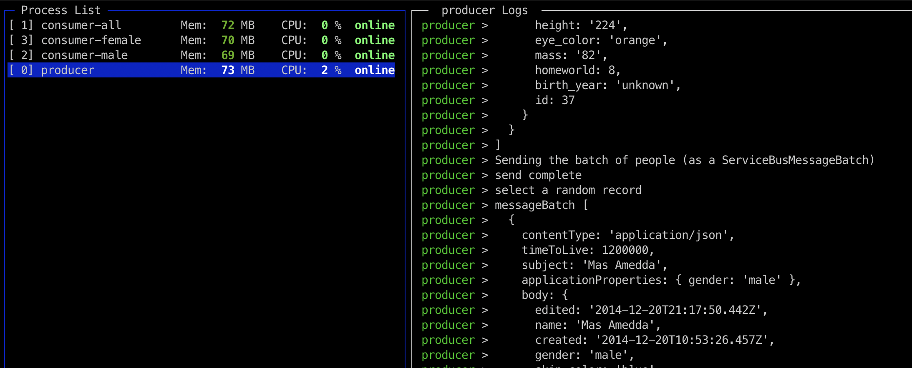
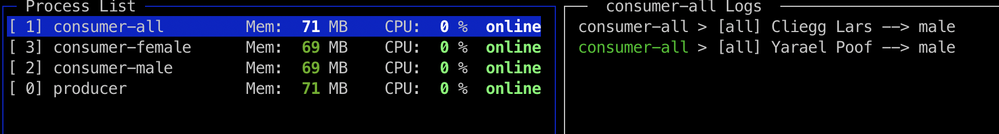
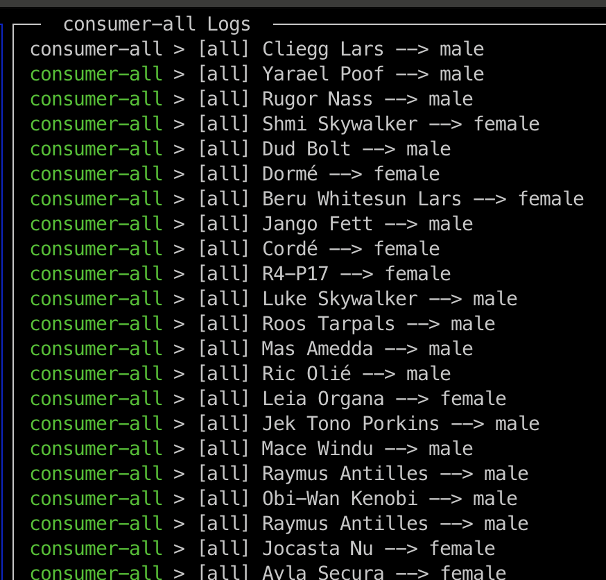
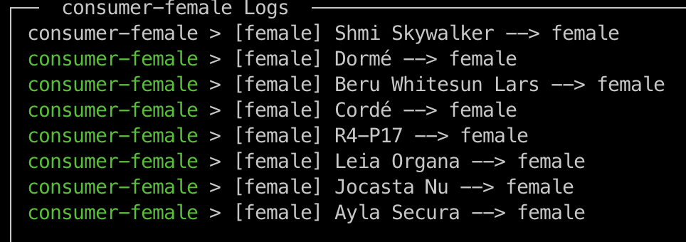

# Azure Service Bus - Multiple Consumers

> This sample project contains a message producer that pushes a random Star Wars person onto a topic queue every 5 seconds. There are three consumers which are subscribed to that topic and will pull messages accordingly.

## Service Bus - Topics

TL;DR:
Queues and Topics are similar when a sender sends messages, but messages are processed differently by a receiver. 

A queue can have only one consumer.


A topic can have multiple subscribers.


## Development Setup

### Requirements

**Install PM2**

```
npm install -g pm2
```

### Configure Infrastructure

The included bicep template will create the following resources:

* Azure ServiceBus Namespace
* Azure ServiceBus Topic
* Subscription consumer-male - Rule to filter on `gender = 'male'`
* Subscription consumer-female - Rule to Filter on `gender = 'female'`
* Subscription consumer-all - No Rule/Filter


```
cd infrastructure

az deployment group create \
  --resource-group my-test-rg \
  --template-file main.bicep
```

### Run Sample Project

```
npm install
npm run start
npm run monitor
```

**Producer**



**Consumers**








### Cleanup Running Instances

```
npm run stop
npm run cleanup
```


